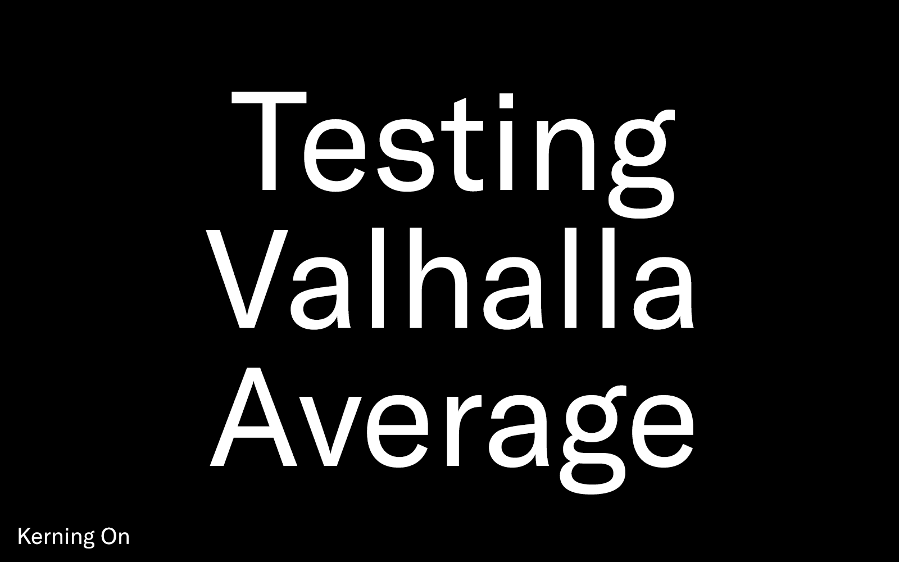
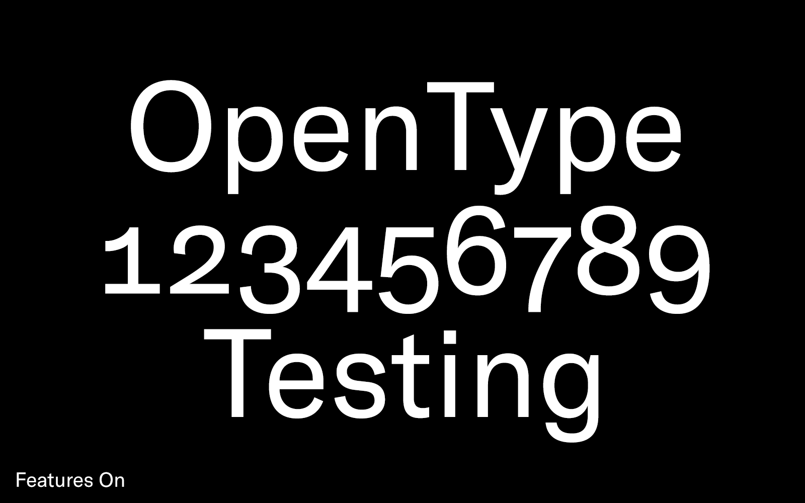
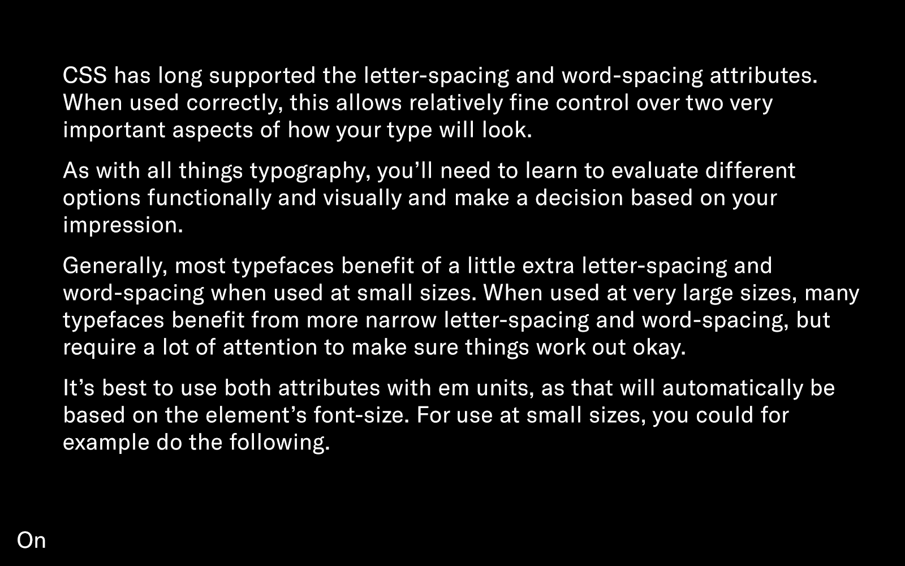

# Using (Grilli Type) web fonts

**Please note that the most up-to-date version of this guide is currently on Grilli Type’s blog: https://www.grillitype.com/blog/guides/using-grilli-type-web-fonts-guide. We will aim to update this version here at some point, as well.**

Luckily it’s now really easy to use custom fonts in websites. The basics are easy to master, and this document hopes to help with that. It also links to further, more in-depth sources that are helpful for more advanced developers aiming to perfect aspects like the specific loading of the font files.

If you don’t know us, make sure to [have a look at the fonts](https://grillitype.com) on our website.

**This document is a continuing work in progress, please let us know if anything is unclear – or if you think anything is wrong. Thank you!**

## Table of contents

* [Web font formats](#web-font-formats)
* [How to embed web fonts in HTML/CSS](#how-to-embed-web-fonts-in-csshtml)
	* [CSS for all formats](#css-for-all-formats)  
	* [CSS for modern formats](#css-for-modern-formats)  
	* [HTML embed code](#html-embed-code)
	* [Hosting your fonts](#hosting-your-fonts)
* [Advanced typographic features](#advanced-typographic-features)
	* [Spacing and kerning](#spacing-and-kerning)
	* [Advanced OpenType features](#advanced-opentype-features)
  * [Letter-spacing and word-spacing](#letter-spacing-and-word-spacing)
* [Font rendering](#font-rendering)
	* [Hinting](#hinting)
	* [Font smoothing](#font-smoothing)
	* [Caution: OptimizeLegibility](#caution-optimizelegibility)
* [Resources](#resources)
* [Even more](#even-more)
	* [Uploading our font files to Github](#uploading-our-font-files-to-github)
	* [Loading web fonts](#loading-web-fonts)
	* [Base64 encoding](#base64-encoded-font-files)
	* [CSS Text Decoration](#css-text-decoration)
* [Comments? Feedback?](#comments-feedback)
	* [Future additions](#future-additions)

## Web font formats:

When you purchase Grilli Type web fonts licensing, you receive the licensed styles in the following formats:

* EOT
Embedded OpenType is a legacy format developed by Microsoft. Older Internet Explorer versions require EOT to render your content in our fonts. As it is often served uncompressed, if you don’t require browser support of the likes of IE8, you’re better off leaving it out.
* TTF: TrueType is a font format developed by Microsoft and Apple in the 80s. Modern TTF files are so-called TrueType OpenType fonts. TTF fonts are useful for extending support to some older browsers, especially on mobile.
* WOFF: Web Open Font Format was developed in 2009 as a wrapper format for TrueType and OpenType fonts. It compresses the fonts and is supported by many modern browsers.
* WOFF2: An update to the original WOFF format, developed by Google, this is the most modern and best format to use. Modern browsers will load this format, and it offers the best file size compression out of all web font formats.

If you are mostly targeting users with modern browsers, you can get away with only offering WOFF2 and WOFF formats. These offer the best compression and allow you to deal with less files.

If you want to expand your support the widest, add EOT and TTF files to the mix.

We do not offer SVG font files anymore, as the user-base for them is extremely small at this point. Google Chrome even removed support for the format completely.

## How to embed web fonts in CSS/HTML:

### CSS for ALL FORMATS:
~~~~css
@font-face {
  font-family: FontName;
  src: url('path/filename.eot');
  src: url('path/filename?#iefix') format('embedded-opentype'),
       url('path/filename.woff2') format('woff2'), 
       url('path/filename.woff') format('woff'),
       url('path/filename.ttf')  format('truetype');
}
~~~~

### CSS for MODERN FORMATS:
~~~~css
@font-face {
  font-family: FontName;
  src: url('path/filename.woff2') format('woff2'), 
       url('path/filename.woff') format('woff');
}
~~~~

### HTML Embed Code
~~~~html
html-element {
  font-family: 'FontName', Helvetica, Arial, sans-serif;
}
~~~~

### Hosting your fonts

At Grilli Type we offer our web fonts for self-hosting. That means that you host them on your own server, and your fonts will always be online when a visitor comes to your website. No tracking code or javascript in general is required to load font files. A lot of small foundries offer fonts this way, and we are convinced it is the best way. 

Other type foundries offer their fonts in other ways. Some offer self-hosting with (not very cumbersome) restrictions, others only offer hosted solutions. Make sure you know how a type foundry’s web fonts are offered before you buy licensing.

## Advanced typographic features

### Spacing and Kerning

Two settings inside font files define the space between characters: Spacing is defined as side bearings on the left and right side of each letter, while kerning means specific adjustments between two characters.

Spacing cannot be turned off and is always turned on, because otherwise the text rendering engine (your browser) wouldn’t know what to do with these letters. Kerning, on the other hand, is turned off by default in browsers and has to be turned on by you in your CSS.

It’s very easy! Here’s how you can activate it across all browsers that support it:

~~~~css
p {
  font-feature-settings:"kern" 1;
  font-kerning: normal;
}
~~~~

If you don’t use something like SASS or PostCSS that helps you with this, you should manually add each browser’s vendor prefix for this setting to extend browser support to older versions:

~~~~css
p {
  -moz-font-feature-settings:"kern" 1; 
  -ms-font-feature-settings:"kern" 1; 
  -o-font-feature-settings:"kern" 1; 
  -webkit-font-feature-settings:"kern" 1; 
  font-feature-settings:"kern" 1;
  font-kerning: normal;
}
~~~~

### Advanced OpenType Features

In the previous paragraphs we’ve looked at the font-feature-settings attribute. It can be used to control all available OpenType features in a web font file. This includes kerning, but extends much further. All of Grilli Type’s web fonts come with all the OpenType features also available in Desktop fonts. This gives you access to alternate characters and other features.

The following code would turn on old-style numerals (onum) that are proportional numerals (pnum), turn on kerning, and also activate Stylistic Set 1 (ss01):

~~~~css
  font-feature-settings:"onum" 1, "pnum" 1, "kern" 1, "ss01" 1;
~~~~

You can use font-feature-settings to activate stylistic alternates, discretionary ligatures, different types of figures available in a font, turn on small caps, and other handy things.

Warning: Because font-feature-settings is used to set many potential OpenType features at once, you can’t just define a single setting differently as your other choices will not be inherited. You need to redefine all features again if you want to change anything for child elements.

### Letter-Spacing and Word-Spacing

CSS has long supported the letter-spacing and word-spacing attributes. When used correctly, this allows relatively fine control over two very important aspects of how your type will look.

As with all things typography, you’ll need to learn to evaluate different options functionally and visually and make a decision based on your impression.

Generally, most typefaces benefit of a little extra letter-spacing and word-spacing when used at small sizes. When used at very large sizes, many typefaces benefit from more narrow letter-spacing and word-spacing, but require a lot of attention to make sure things work out well.

It’s best to use both attributes with _em_ units, as that will automatically be based on the element’s font-size. For use at small sizes, you could for example do the following. This will give your body copy a little more room to breathe.

~~~~css
p {
  letter-spacing: 0.015em;
  word-spacing: 0.001em;
}
~~~~

## Font rendering

Using type on screens brings up important questions about their rendering. Fonts are usually designed on about a 1000 unit grid – or an even finer one – and then you display them at something like a 16 pixel size. In an interplay between device, screen, and software, this reduction in resolution and fidelity requires some smarts to make small type legible and good-looking.

### Hinting

Each operating system does things a little differently. On Apple computers, the smarts are in the operating system (and thus can evolve), while the fonts themselves can be dumb.

Historically, on Windows, the smarts were supposed to be included in the font software, and the system heavily used those smarts to decide how a font should be rendered at sizes like a 12 or 16 pixel.

Those smarts are called hinting. Hinting information embedded in the font files can tell a computer that in an H, the two stems are supposed to be the same stroke width, or that the space above and below the crossbar should be equal at small sizes.

Hinting is a very complex and complicated topic, but the important takeaway is that the same font at the same size might render very differently even on the same computer if you change any factor: the display, the browser, or even just the type’s and background’s color.

At Grilli Type we use computer-generated hinting and quality test our fonts for use on Windows computers. On Mac, on your phone or tablet, and in general on devices with a high display resolution, hinting becomes a lot less important or is even completely ignored by the system. 

### Font Smoothing

While ignoring hinting information included in the font files, browsers on MacOS and iOS offer some additional control over the font rendering.

~~~~css
p {
  -webkit-font-smoothing: antialiased; /* Chrome, Safari */
  -moz-osx-font-smoothing: grayscale; /* Firefox */
}
~~~~

Using these attributes leads to sharper, thinner text rendering on MacOS and iOS. But beware: this can also lead to rendering problems, especially if you use a thin font weight.

The attributes are mainly useful to balance the rendering of fonts in these browsers when using light text on dark backgrounds, as they would otherwise get rendered quite a bit bolder. 

This is not on the path to become a standard CSS feature. Only use this if you know what you’re doing.

### Caution: OptimizeLegibility

We often come across this attribute when troubleshooting our customers’ font use on websites:

~~~~css
p {
  text-rendering: optimizeLegibility;
}
~~~~

Among other things, it activates kerning. That was very useful at some point, but is not needed anymore (as shown above). In addition to kerning, it also activates all kinds of ligatures, including extravagant ones that may be present in the font files.

Although there are some use cases for this, do not use this feature if you don’t know exactly what you’re doing with it.

## Resources

* [Clagnut’s OpenType CSS Sandbox](http://clagnut.com/sandbox/css3/) by Richard Rutter is great place to test out OpenType features and easily put together your required CSS code.
* [Webfont Handbook](https://abookapart.com/products/webfont-handbook) by Bram Stein is the most in-depth (e)book you can possibly read on web fonts, their rendering, and their performance.
* [Copy Paste Character](http://copypastecharacter.com) is a great website that allows you to access pretty much any special character you might ever use.
* [CSS Tricks](https://css-tricks.com/snippets/css/using-font-face/) has a good list of different browser version’s support for various web font format setups.

## Even more

For more advanced developers, there’s even more to think about when using web fonts. 

### Uploading our font files to Github

When you commit a project using our fonts to a public github repository, please make sure that the fonts folder is  listed in your .gitignore so that these do not get uploaded.

This could for example be your .gitignore file:
~~~~
.DS_Store
path/to/web/fonts/folder/*
~~~~

### Loading Web Fonts

Loading web fonts is easy. But it can also be very hard. If you’d like to learn more about FOUT (Flash Of Unstyled Text) and other phenomena, Zach Leat’s [A Comprehensive Guide to Font Loading Strategies](https://www.zachleat.com/web/comprehensive-webfonts/) will make you very happy.

### Base64-encoded font files

In some rare instances, encoding your fonts as base64 inside your CSS will be a good idea. Generally it is not a good idea – and you will most of the time break your font’s licensing agreement. Proceed with a lot of caution.

### CSS Text Decoration

The W3C is working on [a draft for new controls of text decoration](https://drafts.csswg.org/css-text-decor-3/), mainly dealing with how to make underlining text better and easier in CSS. This is not yet usable, but have a look!

## Comments? Feedback?

You can always [email us](mailto:mail@grillitype.com?subject=Web%20Fonts%20Guide) with feedback to this document. You can also comment directly on [Github](https://github.com/grillitype/web-fonts-guide) by adding an issue.

### Future additions

We tried to make this guide comprehensive, but are always open to add more information that could be useful when using web fonts. We are currently planning the following additions: 

* CSS font-weight & font-style: should you put it into @font-face definition?
